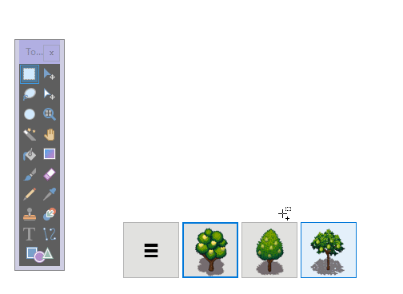

<h1 align="center">
  <b>PikPicPASTE</b>
   
   
  
</h1>

<h2 align="center">A handy little app for copying & pasting images.</h2>

<h1 align="center">
  </a>  
</h1>

## Usage

- Click and drag the hamburger tile to move the toolbar
- Click the hamburger tile to select a folder containing images
- A new tile will be added whose thumbnail is the first image in the folder
- Clicking a tile will copy a random image from its folder to the clipboard
- Focus will automatically return to your editor's window, so you can immediately press CTRL + V to paste it in
- The toolbar stays on top of other windows, so it's always there when you need it

## Compatible with

- GIMP
- Paint.NET
- Microsoft Paint
- ... and more!

## Attribution

- ["[LPC] Fruit Trees" in the GIF preview by bluecarrot16, Joshua Taylor, and cynicmusic. Commissioned by castelonia. See CREDITS-fruit-trees.txt](https://opengameart.org/content/lpc-fruit-trees)
- Inspired by [Image Clipboard](https://stevencolling.itch.io/image-clipboard)

<h1 align="center">
  <a href="https://girkovarpa.itch.io/pikpicpaste#download">
  👉 Download for Windows 👈</a>
</h1>
